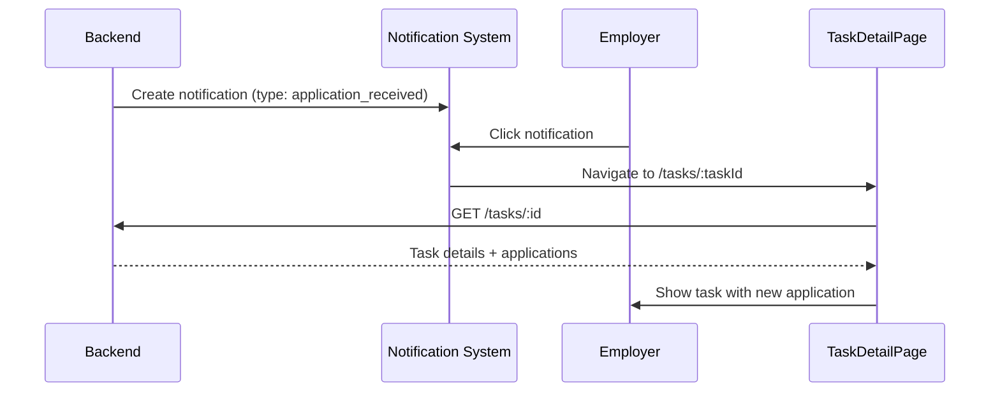
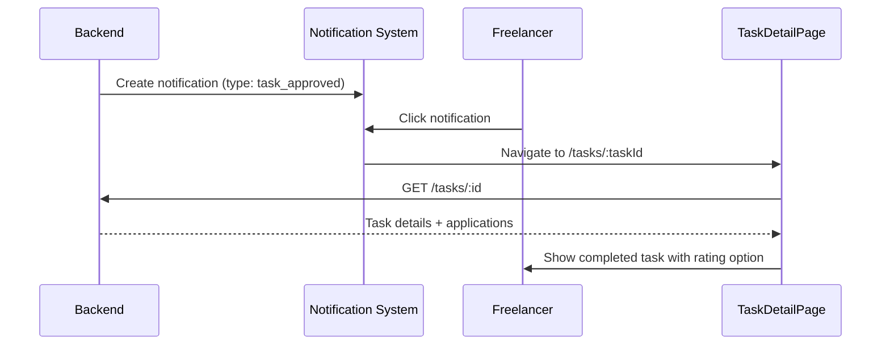

# Task Detail Navigation - Implementation Guide

**Date:** November 26, 2025  
**Status:** ✅ Complete

---

## 📋 Overview

Implemented task detail page navigation from notification system. When users click a task notification, they are taken to a dedicated task detail page showing full task information, applications, and actions.

---

## 🎯 What Was Done

### 1. Created TaskDetailPage Component

**File:** `apps/web/src/components/Tasks/TaskDetailPage.tsx`

Full-page component that:
- Fetches task details from `GET /tasks/:id` API
- Displays task info (title, description, objective, deliverables, acceptance criteria)
- Shows all applications with ApplicationList component
- Provides action buttons (Apply, Submit Work, etc.)
- Auto-adapts UI based on user role (employer vs freelancer)

**Key Features:**
- ✅ Uses React Query for data fetching with 30s stale time
- ✅ Loading state with Spinner.
- ✅ Error handling with 404 page
- ✅ Back button to return to tasks list
- ✅ Deadline warning when task expired
- ✅ Reuses existing modals (ApplyModal, SubmitOutcomeModal, PostRateModal)

### 2. Added Route

**File:** `apps/web/src/routes.tsx`

```tsx
<Route
  element={
    <Suspense fallback={<PostsShimmer />}>
      <TaskDetailPage />
    </Suspense>
  }
  path="tasks/:taskId"
/>
```

### 3. Updated Notification Navigation

**File:** `apps/web/src/components/Notification/NotificationsPage.tsx`

Simplified navigation logic - all task notifications now navigate to `/tasks/:taskId`:

```tsx
switch (notification.type) {
  case "application_received":
  case "task_submitted":
    // Employer notifications
    navigate(`/tasks/${taskId}`);
    break;

  case "application_accepted":
  case "task_approved":
  case "task_rated":
  case "task_needs_revision":
  case "task_created":
    // Freelancer notifications
    navigate(`/tasks/${taskId}`);
    break;

  case "application_rejected":
    // No specific task page
    navigate("/tasks");
    break;
}
```

---

## 🔧 Backend API Integration

### Endpoint Used

```
GET /tasks/:id
```

**Returns:**
```json
{
  "id": "task-uuid",
  "title": "Task Title",
  "description": "...",
  "objective": "...",
  "deliverables": "...",
  "acceptanceCriteria": "...",
  "skills": ["React", "TypeScript"],
  "status": "open",
  "rewardPoints": 100,
  "employerProfileId": "0x...",
  "freelancerProfileId": "0x...",
  "createdAt": "2025-11-26T10:00:00Z",
  "deadline": "2025-12-03T10:00:00Z",
  "checklist": [...],
  "applications": [
    {
      "id": "app-uuid",
      "applicantProfileId": "0x...",
      "status": "pending",
      "appliedAt": "2025-11-26T11:00:00Z",
      ...
    }
  ]
}
```

### API Client Method

Already exists in `apps/web/src/lib/apiClient.ts`:

```typescript
async getTask(taskId: string) {
  return this.request(`/tasks/${encodeURIComponent(taskId)}`);
}
```

---

## 🚀 User Flow

### Flow 1: Employer Receives Application Notification



**Steps:**
1. Freelancer applies to task
2. Backend creates notification for employer
3. Employer clicks notification bell → opens `/notifications`
4. Employer clicks notification card
5. NotificationsPage calls `handleNotificationClick()`
6. Navigate to `/tasks/:taskId`
7. TaskDetailPage fetches task details
8. Shows full task info + applications section
9. Employer can review and accept/reject application

### Flow 2: Freelancer Gets Task Approved Notification



**Steps:**
1. Employer approves freelancer's work
2. Backend creates notification for freelancer
3. Freelancer clicks notification
4. Navigate to `/tasks/:taskId`
5. TaskDetailPage shows task status = "completed"
6. Freelancer can see their application status and rating

---

## 🎨 UI Features

### TaskDetailPage Layout

```
┌─────────────────────────────────────────┐
│ [← Back to Tasks]                       │
├─────────────────────────────────────────┤
│ Task Header Card                        │
│ - Title                        [Status] │
│ - Posted Date | Deadline | Location     │
│ - Skills badges                         │
├─────────────────────────────────────────┤
│ Task Details Card                       │
│ - Description                           │
│ - Objective                             │
│ - Deliverables                          │
│ - Acceptance Criteria                   │
│ - Deadline Warning (if expired)         │
├─────────────────────────────────────────┤
│ Applications Section                    │
│ - ApplicationList component             │
│   (shows all applicants with actions)   │
├─────────────────────────────────────────┤
│ Action Buttons                          │
│ - [Apply for Task] (if not applied)     │
│ - [Submit Work] (if accepted)           │
└─────────────────────────────────────────┘
```

### Responsive Design

- **Desktop:** Full-width cards with proper spacing
- **Mobile:** Stacked layout with touch-friendly buttons
- **Back Button:** Always visible for easy navigation

---

## ✅ Testing Checklist

### Frontend Testing

- [x] Route `/tasks/:taskId` accessible
- [x] TaskDetailPage fetches task data correctly
- [x] Loading state shows Spinner
- [x] Error state shows 404 page
- [x] Back button navigates to `/tasks`
- [x] Status badge shows correct color
- [x] Skills display properly
- [x] Deadline warning appears when expired
- [x] Applications section renders ApplicationList
- [x] Action buttons show based on user role
- [x] Apply modal opens correctly
- [x] Submit Work modal opens correctly

### Notification Integration Testing

- [ ] Click "application_received" notification → navigates to correct task
- [ ] Click "application_accepted" notification → navigates to correct task
- [ ] Click "task_submitted" notification → navigates to correct task
- [ ] Click "task_approved" notification → navigates to correct task
- [ ] Click notification with invalid taskId → shows 404
- [ ] Notification marked as read when clicked
- [ ] Back button returns to notifications page

### Backend Integration Testing

```bash
# 1. Test GET /tasks/:id endpoint
curl http://localhost:3000/tasks/TASK_ID \
  -H "Authorization: Bearer YOUR_TOKEN"

# Expected: Task details with applications array

# 2. Verify notification metadata includes taskId
curl http://localhost:3000/notifications \
  -H "Authorization: Bearer YOUR_TOKEN"

# Expected: notifications with metadata.taskId populated
```

---

## 🐛 Common Issues & Solutions

### Issue: 404 Not Found When Clicking Notification

**Symptoms:**
- Click notification → shows "Task Not Found" page

**Causes:**
1. Backend notification didn't save `relatedTaskId` correctly
2. Task was deleted after notification created
3. Frontend `metadata.taskId` mapping missing

**Solutions:**
1. Check backend notification creation:
   ```typescript
   // Ensure relatedTaskId is saved
   await db.insert(notifications).values({
     type: "application_received",
     relatedTaskId: task.id, // ← Must save this!
     ...
   });
   ```

2. Verify frontend metadata mapping in `apiClient.ts`:
   ```typescript
   const notifications = await this.request('/notifications');
   return notifications.map((n: any) => ({
     ...n,
     metadata: {
       taskId: n.relatedTaskId, // ← Must map this!
       applicationId: n.relatedApplicationId
     }
   }));
   ```

### Issue: Applications Not Showing

**Symptoms:**
- Task detail page loads but applications section empty

**Causes:**
- Backend `GET /tasks/:id` not returning `applications` array

**Solutions:**
- Verify backend returns applications:
  ```typescript
  return c.json({ 
    ...task, 
    applications // ← Must incluccde this!
  });
  
  ```

### Issue: Page Keeps Loading

**Symptoms:**
- Spinner shows indefinitely

**Causes:**
- API endpoint slow or not responding
- React Query cache issue

**Solutions:**
1. Check network tab for API call status
2. Verify backend `/tasks/:id` endpoint is accessible
3. Check React Query devtools for query state
4. Clear cache: `queryClient.invalidateQueries({ queryKey: ["task"] })`

---

## 📝 Future Enhancements

### Phase 2
- [ ] Add breadcrumb navigation (Home > Tasks > Task Title)
- [ ] Add "Share Task" button
- [ ] Add task history timeline
- [ ] Add real-time updates via WebSocket
- [ ] Add task edit button for employer

### Phase 3
- [ ] Add comments section
- [ ] Add file attachments display
- [ ] Add task analytics (views, applications rate)
- [ ] Add similar tasks recommendation

---

## 📚 Related Files

- **Component:** `apps/web/src/components/Tasks/TaskDetailPage.tsx`
- **Routing:** `apps/web/src/routes.tsx`
- **Navigation:** `apps/web/src/components/Notification/NotificationsPage.tsx`
- **API Client:** `apps/web/src/lib/apiClient.ts`
- **Documentation:** `NOTIFICATION_SYSTEM.md`

---

## 🎉 Summary

Task detail navigation from notifications is now fully functional! Users can:
1. ✅ Click task notifications → navigate to dedicated task detail page
2. ✅ View full task information with all applications
3. ✅ Take actions based on their role (apply, submit, review)
4. ✅ Navigate back to tasks list easily

**All notifications now use a unified route pattern:** `/tasks/:taskId`

This simplifies the routing structure and provides a consistent user experience regardless of notification type.

---

**Implementation Complete!** 🚀  
**Last Updated:** November 26, 2025
